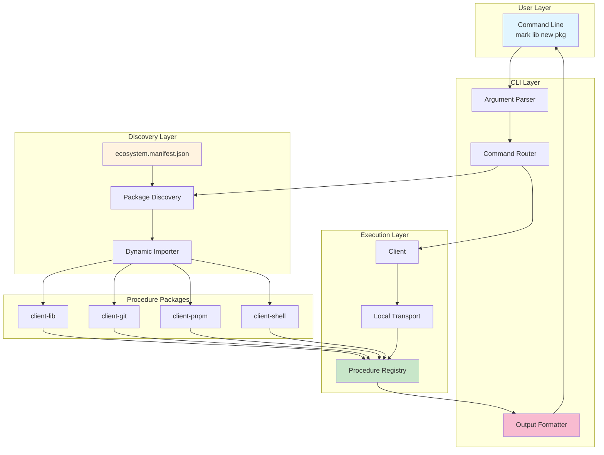
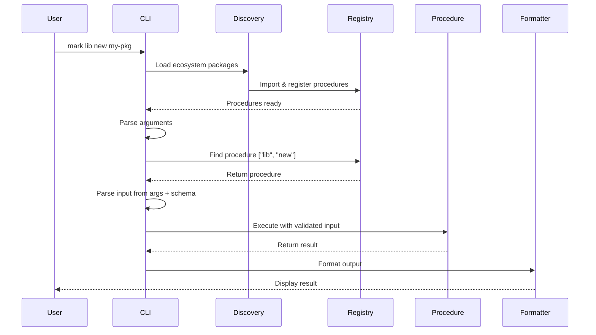
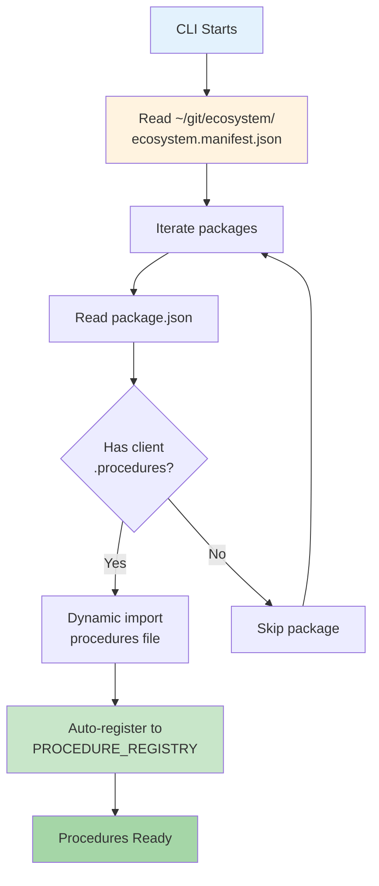
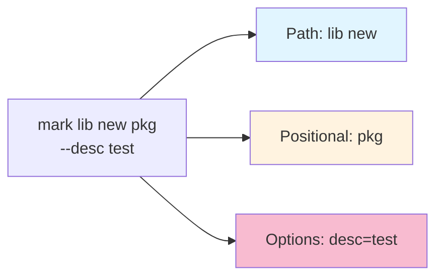
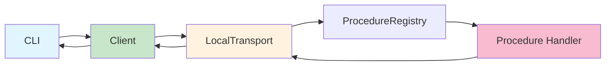

# @mark1russell7/cli

[](https://opensource.org/licenses/MIT)

> Mark CLI - Development workflow automation through dynamic procedure discovery

## Overview

`@mark1russell7/cli` is a dynamic, extensible CLI that automatically discovers and executes procedures from ecosystem packages. It provides a unified interface for development workflows, package management, and automation tasks across the `@mark1russell7` ecosystem.

### Key Features

- **Dynamic Procedure Discovery**: Automatically loads procedures from ecosystem packages
- **Self-Documenting**: Generates help text from procedure schemas
- **Type-Safe**: Leverages Zod schemas for runtime validation
- **Multiple Output Formats**: text, json, table, streaming with spinners
- **Ecosystem-Aware**: Reads ecosystem.manifest.json to discover available packages
- **Extensible**: New commands added by installing procedure packages

## Architecture



## Installation

```bash
npm install @mark1russell7/cli
```

Or from GitHub:

```bash
npm install github:mark1russell7/cli#main
```

### Prerequisites

- Node.js >= 25.0.0
- npm >= 11.0.0

## Execution Flow



## API Reference

### CLI Binary

The package provides a `mark` binary for command-line usage.

#### Basic Syntax

```bash
mark <path...> [positional...] [--options]
```

#### Global Options

| Option | Short | Description |
|--------|-------|-------------|
| `--help` | `-h` | Show help for command or group |
| `--version` | `-v` | Show CLI version |
| `--verbose` | `-V` | Enable verbose output during discovery |
| `--format <format>` | `-f` | Override output format (text, json, table, streaming) |
| `--json <json>` | | Execute raw procedure reference |

#### Examples

```bash
# Show all available commands
mark

# Show help for a command group
mark lib --help

# Show help for specific command
mark lib new --help

# Execute command with options
mark lib new my-package --description "My package"

# Override output format
mark git status --format json

# Verbose discovery
mark lib new my-pkg --verbose
```

### Programmatic API

#### `run(argv: string[]): Promise<void>`

Main CLI entry point.

```typescript
import { run } from "@mark1russell7/cli";

// Execute CLI programmatically
await run(["lib", "new", "my-package"]);
```

#### `parseFromSchema(params, meta): Record<string, unknown>`

Parse CLI arguments based on procedure metadata.

```typescript
import { parseFromSchema } from "@mark1russell7/cli";

const params = {
  array: ["my-package"],
  options: { description: "My pkg" }
};

const meta = {
  args: ["name"],
  shorts: { description: "d" }
};

const input = parseFromSchema(params, meta);
// { name: "my-package", description: "My pkg" }
```

#### `generateHelp(path, meta, schema?): string`

Generate help text for a procedure.

```typescript
import { generateHelp } from "@mark1russell7/cli";

const help = generateHelp(
  ["lib", "new"],
  {
    description: "Create a new library package",
    args: ["name"],
    shorts: { skipGit: "g" }
  },
  schema
);

console.log(help);
```

#### `formatOutput(print, result, format): void`

Format and print procedure results.

```typescript
import { formatOutput } from "@mark1russell7/cli";
import { print } from "gluegun";

formatOutput(print, { message: "Success!" }, "text");
formatOutput(print, { rows: [...] }, "table");
formatOutput(print, { data: {...} }, "json");
```

### CLI Metadata Interface

Procedures define CLI behavior via metadata:

```typescript
interface CLIMeta {
  /** Description for help text */
  description?: string;

  /** Field names that are positional args (in order) */
  args?: string[];

  /** Short flag mappings: { fieldName: "f" } */
  shorts?: Record<string, string>;

  /** Output format hint */
  output?: "text" | "json" | "table" | "streaming";

  /** Whether to prompt for missing required fields */
  interactive?: boolean;
}
```

### Output Format Types

```typescript
type OutputFormat = "text" | "json" | "table" | "streaming";
```

## Ecosystem Discovery

The CLI uses a multi-step discovery process to find and load procedures:

### Discovery Flow



### Package Structure

For a package to be discovered, it must:

1. Be listed in `ecosystem.manifest.json`
2. Have a `client.procedures` field in package.json
3. Export procedure registrations from that file

**Example package.json:**
```json
{
  "name": "@mark1russell7/client-lib",
  "client": {
    "procedures": "./dist/register.js"
  }
}
```

**Example register.js:**
```typescript
import { defineProcedure } from "@mark1russell7/client";
import { z } from "zod";

const libNew = defineProcedure({
  path: ["lib", "new"],
  input: z.object({
    name: z.string(),
  }),
  handler: async (input, ctx) => {
    // Implementation
    return { message: "Created!" };
  },
  metadata: {
    description: "Create a new library",
    args: ["name"],
  },
});

// Auto-registers when imported
```

### Discovery Sources

| Source | Path | Description |
|--------|------|-------------|
| Ecosystem Manifest | `~/git/ecosystem/ecosystem.manifest.json` | Primary source of truth |
| Package Metadata | `<pkg>/package.json` | Contains `client.procedures` path |
| Procedure Registry | `PROCEDURE_REGISTRY` | Global registry from `@mark1russell7/client` |

## Argument Parsing

The CLI uses a smart parser that detects procedure paths and maps arguments correctly.

### Path Detection



### Parsing Rules

1. **Path Segments**: Consumed until a procedure match is found
2. **Positional Args**: Non-flag arguments after the path
3. **Options**: Arguments starting with `--` or `-`
4. **Short Flags**: Single-character flags with `-`
5. **Boolean Flags**: Flags without values default to `true`

### Examples

```bash
# Simple command
mark lib new my-package
# path: ["lib", "new"]
# positional: ["my-package"]

# With options
mark lib new my-package --description "My package" --skip-git
# path: ["lib", "new"]
# positional: ["my-package"]
# options: { description: "My package", skipGit: true }

# Short flags
mark git commit -m "message" --amend
# path: ["git", "commit"]
# options: { m: "message", amend: true }

# With equals syntax
mark pnpm add lodash --dev=true
# path: ["pnpm", "add"]
# positional: ["lodash"]
# options: { dev: true }
```

### Metadata-Based Mapping

```typescript
// Procedure metadata
metadata: {
  args: ["name", "version"],     // Positional mapping
  shorts: { skipGit: "g" },      // Short flag mapping
}

// Command
// mark lib new my-pkg 1.0.0 -g

// Parsed input
{
  name: "my-pkg",
  version: "1.0.0",
  skipGit: true
}
```

## Output Formatting

The CLI supports multiple output formats for different use cases.

### Text Format

Default format for human-readable output.

```typescript
// Result with message
{ message: "Package created successfully!" }
// Output: Package created successfully!

// Result with output field
{ output: "file contents..." }
// Output: file contents...

// Result with error
{ success: false, message: "Failed to create" }
// Output: [ERROR] Failed to create
```

### JSON Format

Structured output for programmatic consumption.

```bash
mark lib list --format json
```

```json
{
  "packages": ["pkg1", "pkg2"],
  "count": 2
}
```

### Table Format

Tabular data display.

```bash
mark lib list --format table
```

```
name          version    path
my-package    1.0.0      ~/git/my-package
other-pkg     2.1.0      ~/git/other-pkg
```

### Streaming Format

Shows a spinner during execution, then displays the result.

```bash
mark lib refresh --format streaming
# Running lib refresh...
# lib refresh complete
# Result displayed
```

## Integration with Ecosystem

The CLI integrates seamlessly with the ecosystem infrastructure:

### Ecosystem Manifest

Located at `~/git/ecosystem/ecosystem.manifest.json`:

```json
{
  "version": "1.0.0",
  "root": "~/git",
  "packages": {
    "@mark1russell7/client-lib": {
      "repo": "github:mark1russell7/client-lib#main",
      "path": "client-lib"
    },
    "@mark1russell7/client-git": {
      "repo": "github:mark1russell7/client-git#main",
      "path": "client-git"
    }
  }
}
```

### Procedure Packages

Each client package can export procedures:

```
client-lib/
├── src/
│   ├── procedures/
│   │   ├── lib.new.ts
│   │   └── lib.refresh.ts
│   └── register.ts         # Exports all procedures
├── dist/
│   └── register.js         # Built procedures
└── package.json
    └── client.procedures: "./dist/register.js"
```

### Transport Layer



## Available Commands

Commands are discovered dynamically. Common procedure packages include:

### client-lib

Package management and scaffolding:
- `mark lib new <name>` - Create new package
- `mark lib refresh [path]` - Refresh package dependencies
- `mark lib list` - List all packages

### client-git

Git operations:
- `mark git status` - Show git status
- `mark git commit` - Create commit
- `mark git push` - Push to remote

### client-pnpm

Package manager operations:
- `mark pnpm install` - Install dependencies
- `mark pnpm add <pkg>` - Add package
- `mark pnpm remove <pkg>` - Remove package

### client-shell

Shell command execution:
- `mark shell run <command>` - Run shell command
- `mark shell exec <command>` - Execute command
- `mark shell which <binary>` - Find binary in PATH

### client-procedure

Procedure management:
- `mark procedure new <path>` - Create new procedure
- `mark procedure list` - List all procedures

## Advanced Usage

### Procedure References

Execute procedures via JSON for advanced scripting:

```bash
# Execute procedure reference
mark --json '{
  "$proc": ["lib", "new"],
  "input": {
    "name": "my-package",
    "description": "Test package"
  }
}'
```

### Chaining Commands

Use standard shell pipes:

```bash
# Get package list and filter
mark lib list --format json | jq '.packages[]'

# Create and immediately refresh
mark lib new my-pkg && mark lib refresh my-pkg
```

### Environment Variables

The CLI respects standard environment variables:

```bash
# Set home directory
export HOME=/custom/path

# Verbose mode
export VERBOSE=1
mark lib new my-pkg

# Custom ecosystem location
export ECOSYSTEM_PATH=/path/to/ecosystem
```

## Development

### Building

```bash
npm run build
```

### Testing

```bash
npm test
npm run test:e2e
```

### Project Structure

```
cli/
├── src/
│   ├── cli.ts           # Main CLI implementation
│   ├── parse.ts         # Argument parser
│   ├── format.ts        # Output formatters
│   ├── ecosystem.ts     # Discovery system
│   └── index.ts         # Public API
├── dist/                # Compiled output
│   ├── cli.js          # Main entry point
│   └── index.js        # Public API exports
└── package.json
    └── bin: { "mark": "./dist/cli.js" }
```

### Key Modules

#### cli.ts

Main CLI implementation:
- Command routing
- Procedure execution
- Help generation
- Error handling

#### parse.ts

Argument parsing and schema introspection:
- `parseFromSchema()` - Parse args based on metadata
- `generateHelp()` - Generate help text
- `extractSchemaFields()` - Introspect Zod schemas

#### format.ts

Output formatting:
- `formatOutput()` - Format results based on type
- `formatText()` - Plain text output
- `formatTable()` - Tabular output

#### ecosystem.ts

Procedure discovery:
- `discoverFromEcosystem()` - Find procedure packages
- `loadEcosystemProcedures()` - Load and register procedures
- `listEcosystemProcedurePackages()` - List available packages

## Troubleshooting

### Ecosystem Manifest Not Found

```
Warning: ecosystem.manifest.json not found
```

**Solution:** Ensure `~/git/ecosystem/ecosystem.manifest.json` exists. The CLI will still work but won't auto-discover procedures.

### Procedure Not Found

```
Unknown command: mark foo bar
```

**Solution:**
1. Check if the package is in ecosystem.manifest.json
2. Verify the package has `client.procedures` in package.json
3. Ensure the package is built (`npm run build` in the package)
4. Use `--verbose` to see which packages are being loaded

### Import Error

```
Failed to load procedures from @mark1russell7/client-foo
```

**Solution:**
1. Check that the procedures file exists at the specified path
2. Verify the file is valid JavaScript (not TypeScript)
3. Build the package: `cd <package> && npm run build`

### Help Not Showing Schema Fields

```
# Only shows basic help without field details
```

**Solution:** Ensure procedures have Zod schemas defined in the `input` field. The CLI introspects schemas to generate detailed help.

## Dependencies

The CLI depends on:

- `@mark1russell7/client` - Client library and procedure system
- `@mark1russell7/client-*` - Various procedure packages
- `gluegun` - CLI framework utilities
- `zod` - Schema validation

## License

MIT

## Repository

https://github.com/mark1russell7/cli

## Author

Mark Russell <marktheprogrammer17@gmail.com>
